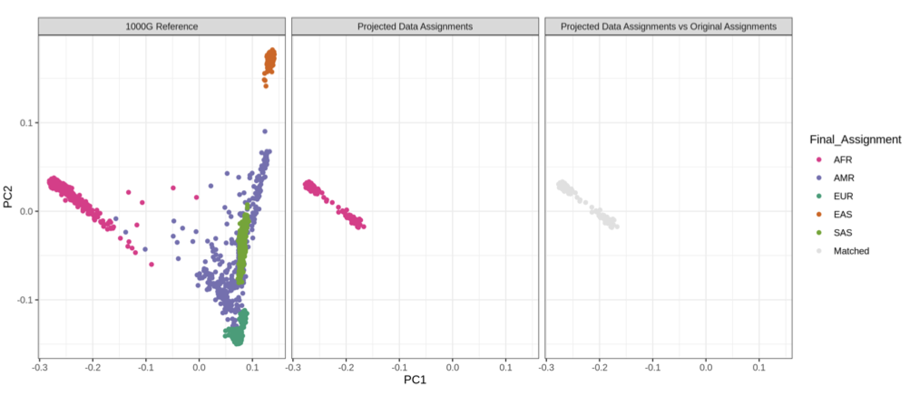
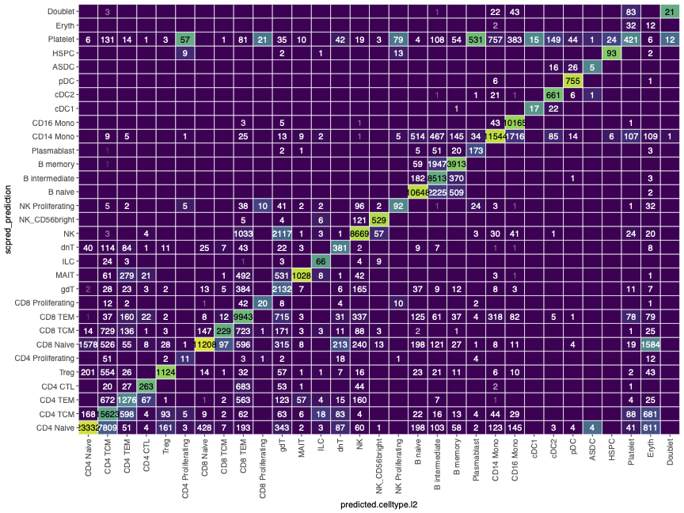
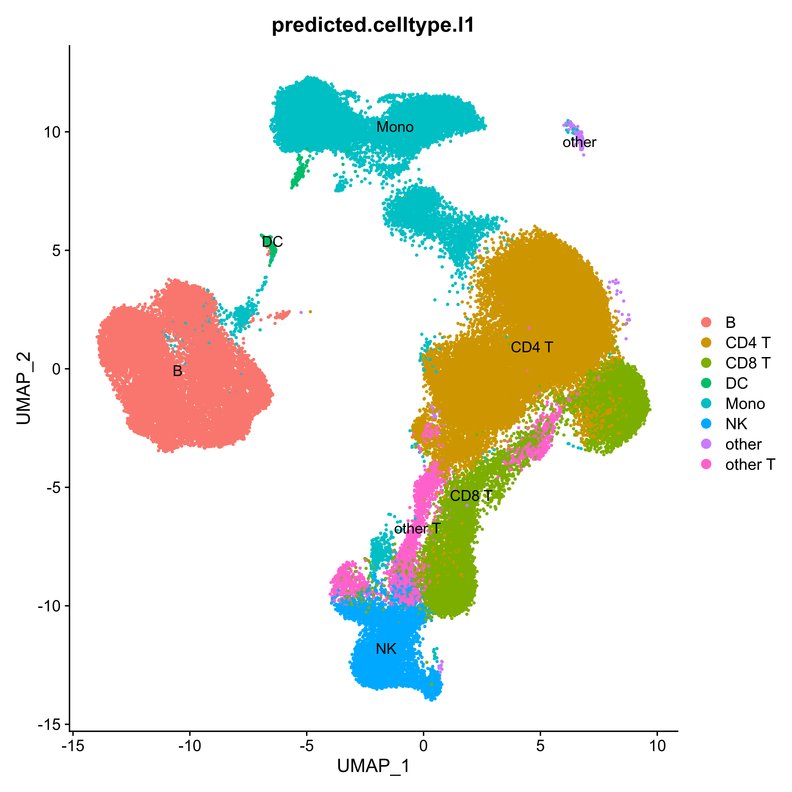
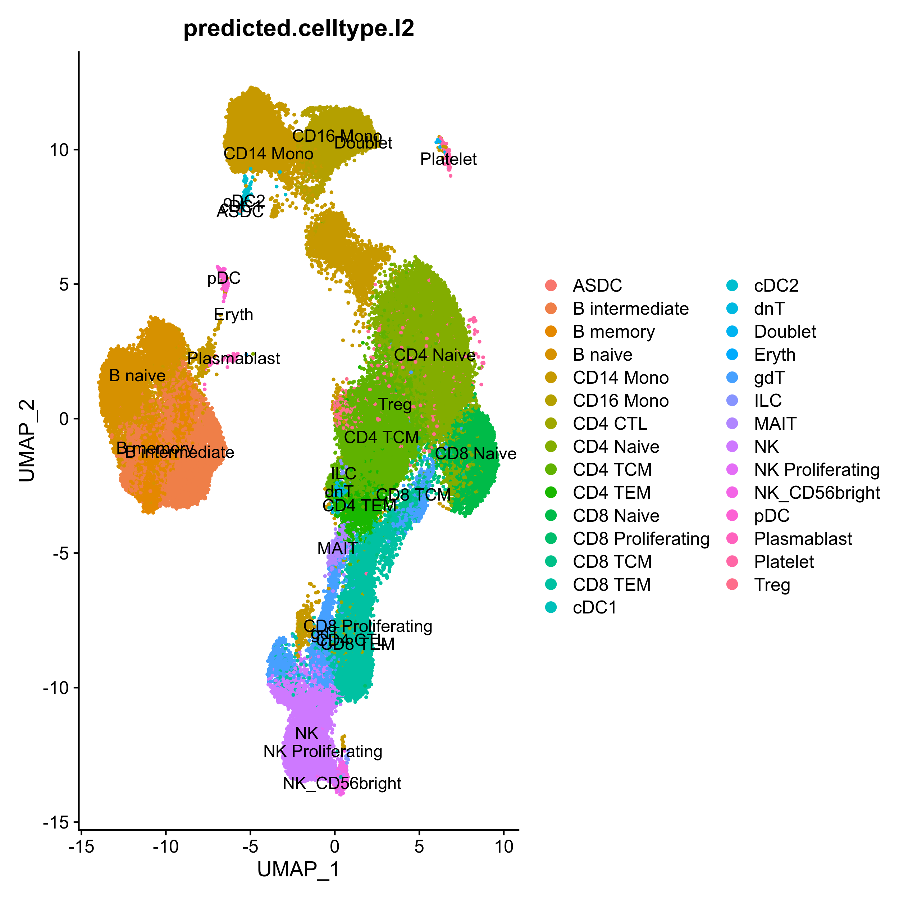
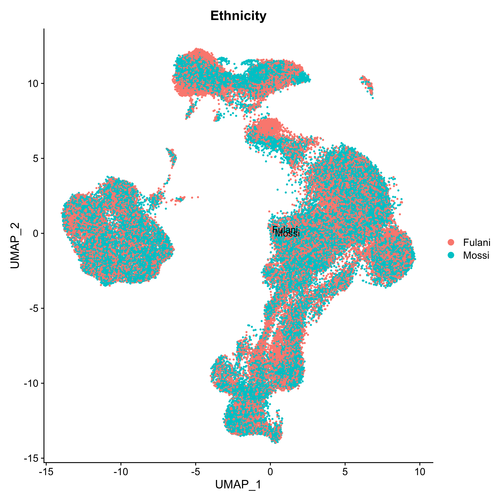

# The Impact of Ethnicity on the Single-cell Immune Response to Falciparum Malaria  [](https://doi.org/10.5281/zenodo.14284664)


This repository contains the information related to **The Impact of Ethnicity on the Single-cell Immune Response to Falciparum Malaria**.

1. [Data repository](#data-information)  
2. [Consortium analysis](#consortium-analysis)  
3. [eQTL analysis](#eqtl-analysis)  
4. [In-house analysis](#independent-unsupervised-clustering)  
5. [Comparison between two pipelines](#comparison-between-2-pipelines)  

---

### Data Information

The multiplexed 10x scRNA-seq using the 10x Genomics Chromium with the Single Cell 3’ library was sequenced in two batches on the Illumina NovaSeq 6000 instrument. The sequenced data was subsequently processed using Cell Ranger (3.0.2) by aligning to the human transcriptome (GRCh38-1.2.0) for each pool:

```bash
cellranger count \
--id=Pool007-G7_cellrangerCount \
--fastqs=. \
--sample=Pool007-G7 \
--transcriptome=refdata-cellranger-GRCh38-1.2.0 \
--jobmode=local \
--localcores=14 \
```

Cell Ranger output per batch is available via Gene Expression Omnibus:

**Batch 1:** [GSE273781](https://www.ncbi.nlm.nih.gov/geo/query/acc.cgi?acc=GSE273781)  
**Batch 2:** [GSE273785](https://www.ncbi.nlm.nih.gov/geo/query/acc.cgi?acc=GSE273785)  

Seurat RDs file and supplementry files are availvale in this [**google folder**](https://drive.google.com/drive/folders/1SKmAB3cIQhjWvicYUXdpejSxxvWF3zUU?usp=share_link)

---

### Consortium Analysis

**1) Genotype Quality Control and Phasing**  
Genotype data was initially quality-controlled by comparison to the 1000 Genomes Project to validate sex and ancestry matches. Phasing of the genotype data was performed using Eagle, and imputation was carried out with Minimac4. The resulting phased and imputed genotype data was used for de-multiplexing samples and identifying doublets within each pool. Detailed information on the pipeline and scripts is available [here](https://wg1-pipeline-qc.readthedocs.io/en/latest/Imputation/index.html#imputation).



**2) Demultiplexing and Doublet Removal**  
Demultiplexing and doublet identification were conducted using multiple tools, including Demuxlet and Scrublet. The initial dataset comprised 33,694 genes across ~196K cells, derived from two batches and 32 pools. Droplet-type assignment and associated confidence scores for each cell were computed and reported in `output_all_Pools_Assignment.txt` for all the software used. Highly confident singlets (~167K cells) were selected for downstream analysis using an intersectional method outlined in the pipeline (`results_Final_all_Pools_Assignment.txt`). Detailed information on the pipeline and scripts is available [here](https://wg1-pipeline-qc.readthedocs.io/en/latest/Demultiplexing/index.html#demultiplexing).

**3) Cell Type Identification**  
Cell type identification was performed using two independent methods: Azimuth (a reference-based method within the Seurat framework) and scPred. The results from both methods were merged and compared. Detailed information on the pipeline and scripts is available [here](https://powellgenomicslab.github.io/WG2-pipeline-classification-docs/).



---

### eQTL Analysis

Pseudobulk data was created using the Muscat tool (`Muscat-DGEA.R`).

---

### Independent Unsupervised Clustering

The demultiplexed and doublet-removed single-cell data was used to perform unsupervised  de novo clustering (Louvain method) and compare the cells to the reference-based method. We employed similar QC filtering for both methods. The script `Harmony.R` contains the method used for independent clustering analysis. For comparative analysis, cells with predicted scores < 0.7 at the predicted cell level 2 were removed.

#### Clustering Based on Resolution 0.8 and 40 Dimensions

**UMAP: Seurat Clusters**  


**UMAP: Level 1 Annotation Based on PBMC Multimodal**  


**UMAP: Level 2 Annotation Based on PBMC Multimodal**  


**UMAP: Based on Ethnicity**  


---

### Comparison Between Two Pipelines

Summary table based on cell type prediction between reference-based and Louvain methods:

| Level 2 Annotation     | #Cells Reference-Based | #Cells Louvain Filtered 0.7 |
|-------------------------|-------------------------|-----------------------------|
| B intermediate         | 5744                   | 5532                        |
| B memory               | 1955                   | 1990                        |
| B naive                | 5571                   | 5668                        |
| CD4 CTL                | 68                     | 79                          |
| CD4 Naive              | 9153                   | 10243                       |
| CD4 Proliferating      | 4                      |                             |
| CD4 TCM                | 11791                  | 9824                        |
| CD4 TEM                | 779                    | 766                         |
| CD8 Naive              | 4741                   | 4356                        |
| CD8 TCM                | 33                     | 46                          |
| CD8 TEM                | 6444                   | 6304                        |
| CD14 Mono              | 5367                   | 7065                        |
| CD16 Mono              | 5034                   | 4893                        |
| cDC1                   | 2                      | 2                           |
| cDC2                   | 130                    | 127                         |
| dnT                    | 100                    | 95                          |
| Doublet                | 5                      | 10                          |
| Eryth                  | 6                      |                             |
| gdT                    | 1565                   | 1548                        |
| HSPC                   | 5                      |                             |
| ILC                    | 23                     | 20                          |
| MAIT                   | 484                    | 466                         |
| NK                     | 4660                   | 4690                        |
| NK Proliferating       | 9                      | 2                           |
| NK_CD56bright          | 296                    | 263                         |
| pDC                    | 293                    | 286                         |
| Plasmablast            | 84                     | 78                          |
| Platelet               | 138                    | 133                         |
| Treg                   | 438                    | 435                         |

To measure the similarity between two clustering methods while accounting for chance and differences, we used the Python module `adjusted_rand_score` from `sklearn.metrics`.

- **Rand Score (Level 2 Annotation):** 0.8341  
- **Rand Score (Cluster IDs):** 0.6690  

**Finding Common Cells Between the Two Methods (Seurat Level 2 Annotation)**

```r
Idents(seurat_combined) <- "predicted.celltype.l2"

common_cells <- intersect(colnames(seurat_combined), colnames(Consortium))
harmony_clusters <- as.vector(Idents(seurat_combined)[common_cells])
Consortium_clusters <- as.vector(Idents(Consortium)[common_cells])
filtered_clusters <- tolower(Consortium_clusters)
df <- data.frame(cell = common_cells, harmony_clusters, filtered_clusters)
head(df)
write.csv(df, "Harmony_0.8_40Dims_common_cluster_assignments_Filtered_0.7.csv", row.names = FALSE)
```

**Finding Common Cells Between the Two Methods (Seurat Cluster IDs)**

```r
Idents(seurat_combined) <- "seurat_clusters"

common_cells <- intersect(colnames(seurat_combined), colnames(Consortium))
harmony_clusters <- as.vector(Idents(seurat_combined)[common_cells])
Consortium_clusters <- as.vector(Idents(Consortium)[common_cells])
filtered_clusters <- tolower(Consortium_clusters)
df <- data.frame(cell = common_cells, harmony_clusters, filtered_clusters)
head(df)
write.csv(df, "Harmony_0.8_40Dims_common_clusterID_Filtered_0.7.csv", row.names = FALSE)
```

**Calculating Rand Score Based on Cluster ID**

```python
import pandas as pd
from sklearn.metrics import adjusted_rand_score

df = pd.read_csv("Harmony_0.8_40Dims_common_clusterID_Filtered_0.7.csv")
harmony_clusters = df['harmony_clusters']
filtered_clusters = df['filtered_clusters']

# Calculate Adjusted Rand Index
ari_score = adjusted_rand_score(harmony_clusters, filtered_clusters)
print("Cluster Level:", ari_score)
```

